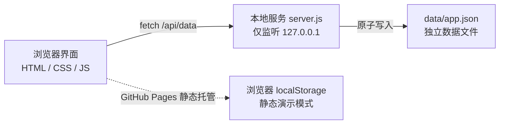
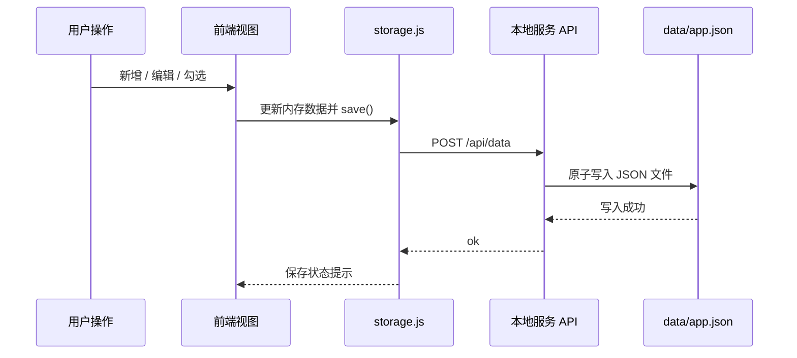
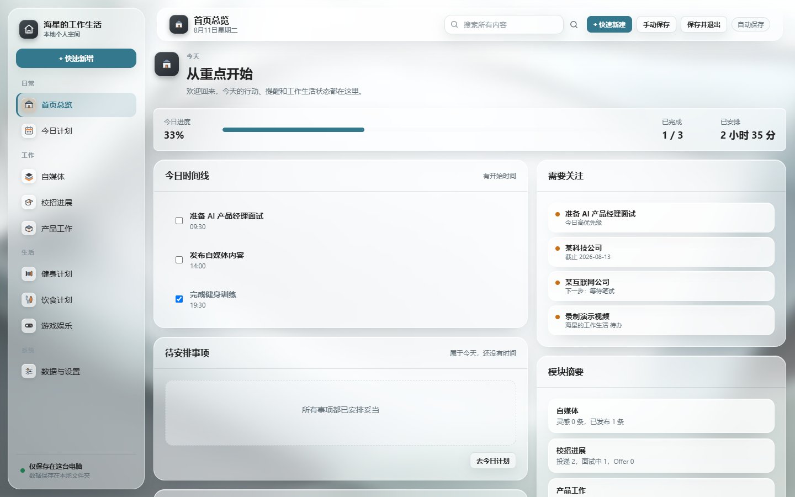
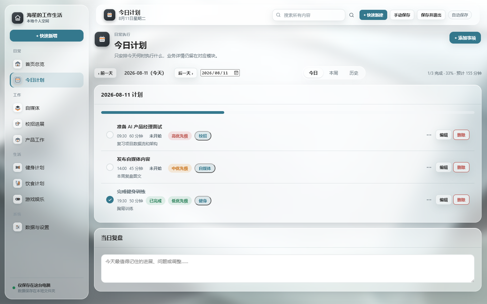
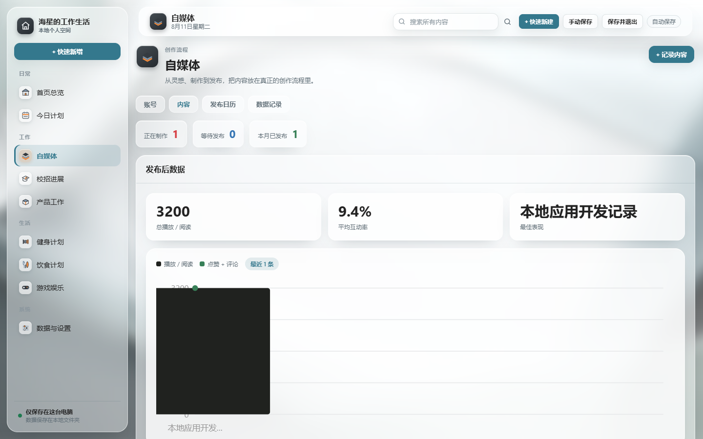
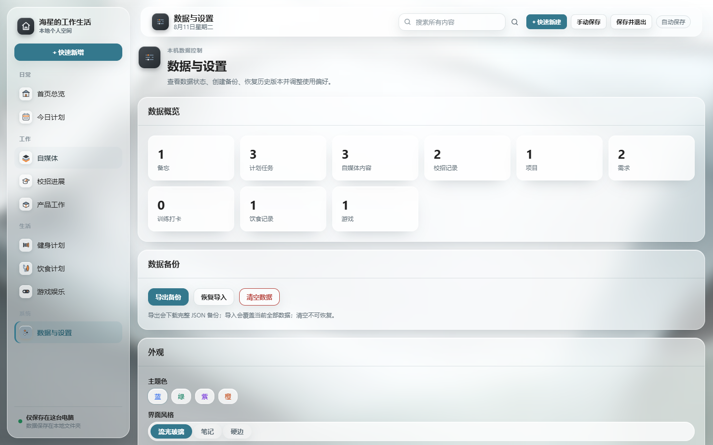

# 海星的工作生活

一款只在自己电脑上运行的个人工作生活管理产品。把今日计划、自媒体创作、校招求职、产品工作、健身、饮食和游戏娱乐集中在一个本地工作台中，数据保存在独立文件里，不上传、不联网、不依赖云服务。

## 项目背景

个人在求职、工作和生活并行时，信息分散在备忘录、表格和各类工具中：计划没有统一入口，校招投递状态靠记忆，创作灵感散落各处。本项目以“我”为唯一目标用户，验证一个问题：能否用一个小而完整的产品，把个人工作生活管理收敛到一个本地工作台，同时保证数据完全由自己掌控。

## 产品定位

- 单用户、单机、本地优先的个人工作台
- 数据保存在电脑独立文件夹，刷新、关闭、重启不丢失
- 每个模块按真实场景设计，不是统一任务列表换名字
- 零依赖运行：纯 HTML/CSS/JavaScript + Node 原生本地服务
- 隐私与离线是核心约束，因此不做登录、云同步和公网部署

## 在线演示

项目默认本地运行，也可以直接体验 GitHub Pages 静态演示版：

- [在线演示（空数据）](https://pdx1601166367-jpg.github.io/haixin-own-app/)
- [在线演示（含示例数据）](https://pdx1601166367-jpg.github.io/haixin-own-app/?demo=1)

线上为静态演示，数据保存在当前浏览器；完整版本地运行，数据写入 `data/app.json`。

## 功能总览

| 模块 | 核心能力 |
| --- | --- |
| 首页总览 | 今日进度、时间线、待安排、快速备忘、需要关注、模块摘要 |
| 今日计划 | 今日/本周/历史视图、状态流转、预计时长、当日复盘 |
| 自媒体 | 五阶段创作流程、发布数据图表、发布日历、加入今日计划 |
| 校招进展 | 状态看板、流程时间线、投递统计、下一步行动 |
| 产品工作 | 项目、里程碑、需求类型与筛选、待办、工作日志 |
| 健身计划 | 训练模板、训练日历、打卡记录、身体指标趋势 |
| 饮食计划 | 营养目标、计划/实际分离、饮食日历、复制昨天 |
| 游戏娱乐 | 游戏库、游玩计时、进度目标、心愿单 |
| 数据与设置 | 本地文件存储、备份导出、恢复导入、三套外观、明暗主题 |

全局能力：分组导航、全局搜索（Ctrl+K）、快速新增、手动保存、保存状态提示、模块开关。

## 界面外观

- 流光玻璃：半透明毛玻璃卡片、柔和壁纸、2.5D 撞色图标
- 笔记：米白底色、轻度毛玻璃、黑色主按钮、红蓝绿统计数字
- 硬边：米色纸底、网格背景、2px 硬边框、偏移硬阴影
- 三种外观均支持浅色与深色主题

## 架构图



## 数据流



静态演示模式会自动检测不到本地 API，降级为浏览器存储，不影响页面交互。

## 快速开始

需要 Node.js 22 或更高版本。

Windows 双击 `启动.bat`，macOS 双击 `启动.command`，脚本会启动本地服务并打开 `http://127.0.0.1:4567`。

## 数据与备份

- 数据保存在 `data/app.json`，复制该文件即可手动备份
- 设置页支持 JSON 备份导出、恢复导入、清空数据
- 旧的浏览器 localStorage 数据首次启动会自动迁移到数据文件

## 测试结果

项目共 164 项自动化测试，全部通过：

| 类型 | 数量 | 覆盖内容 |
| --- | --- | --- |
| 数据层单元测试 | 14 | 存储、迁移、导入导出、统计、搜索、月历 |
| 浏览器端到端测试 | 150 | 九大模块、全局搜索、备份恢复、文件存储、外观、布局稳定性、静态演示 |

其中包含 PRD 第 10 节 20 条验收标准。运行方式：

```bash
npm install
npm test
```

## 演示截图









## 路线图

### v1.0（已完成）

- 九大模块与首页总览
- 本地文件夹存储与备份恢复
- 三套外观与明暗主题
- 全局搜索与快速新增
- 161+ 项自动化测试与 PRD 验收

### v1.1（规划中）

- 回收站与恢复
- 自动备份与保留策略
- CSV / ZIP 数据导出
- 咨询工作模块
- AI 辅助能力：当日复盘总结、内容创作建议、投递进度提醒

## 项目结构

```text
index.html          应用入口
server.js           本地服务（静态文件 + 数据文件 API）
启动.bat             Windows 启动脚本
启动.command         macOS 启动脚本
css/                全局样式、设计系统、三套外观
js/                 存储层、通用组件、视图
docs/screenshots/   演示截图
assets/ambient/     流光外观背景资源
tests/              单元与端到端测试
PRD.md              产品需求文档
DEVELOPMENT_PLAN.md 开发计划
OPTIMIZATION_NOTES.md 参考学习与优化记录
```

## 许可证

MIT License
